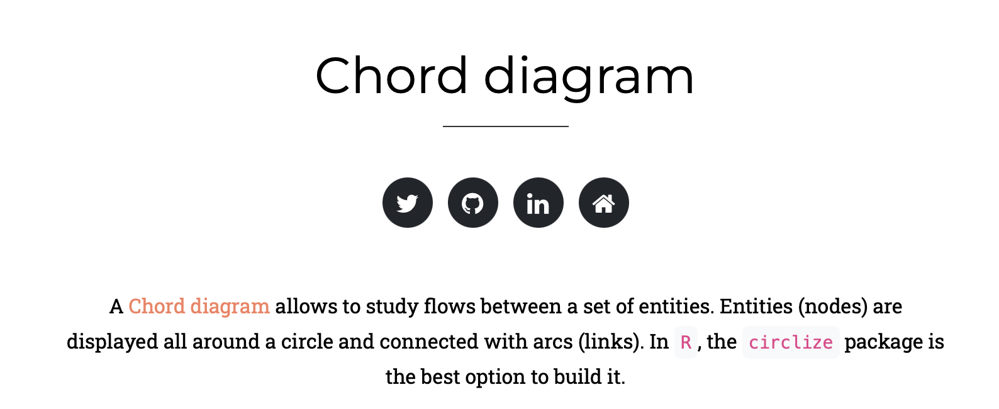
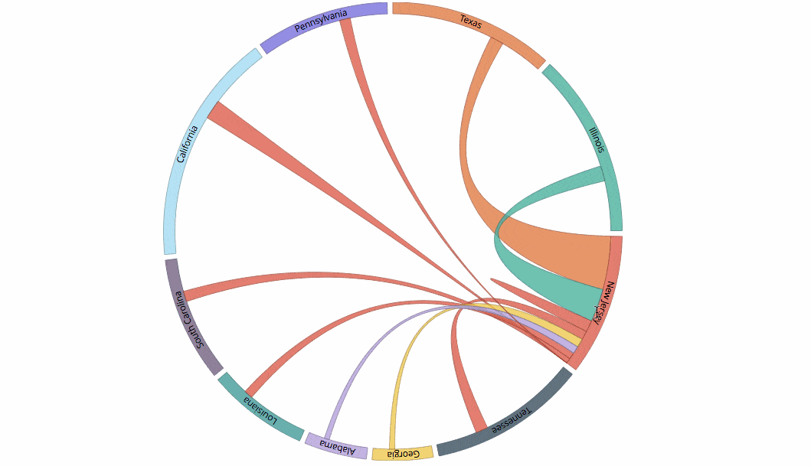
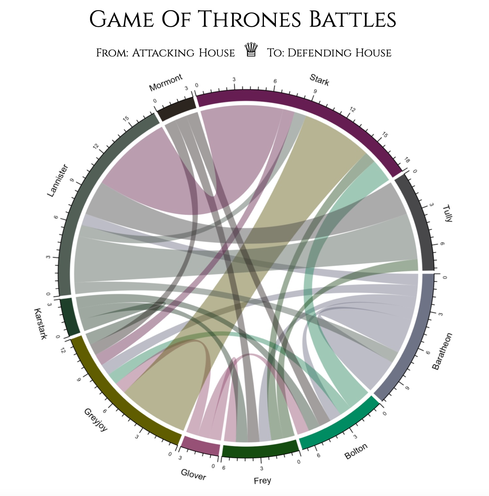
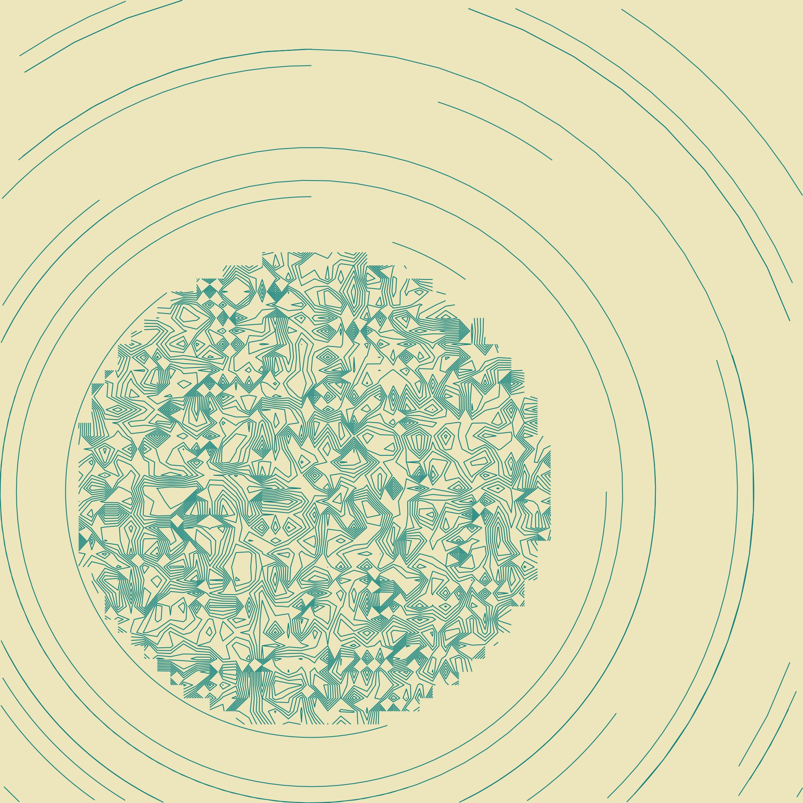
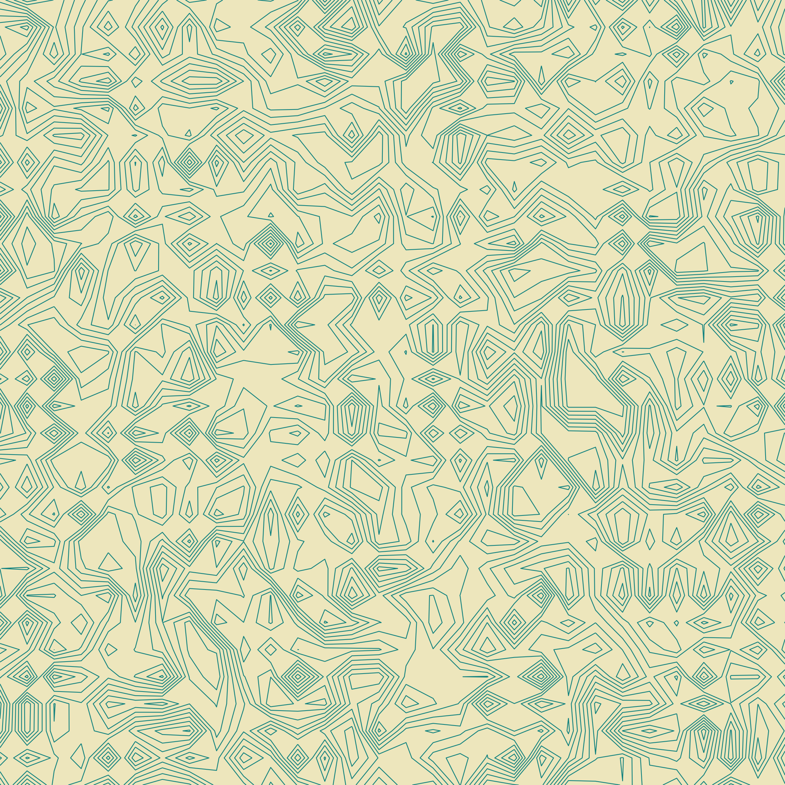
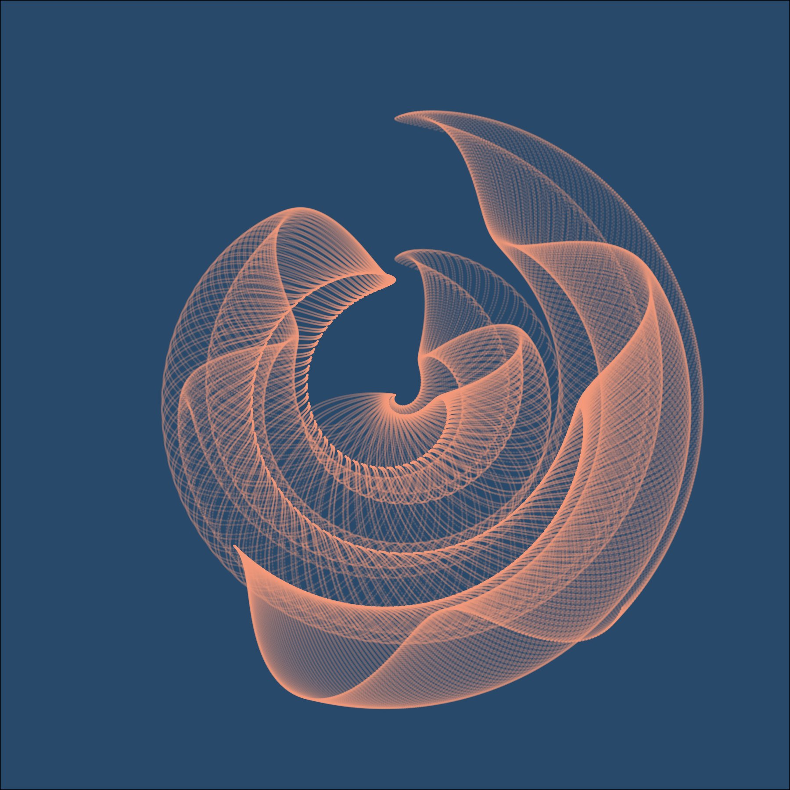
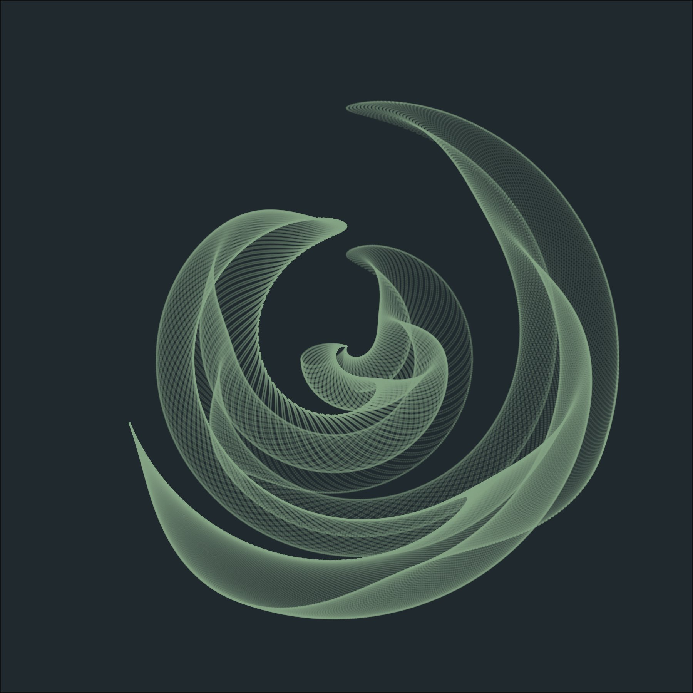
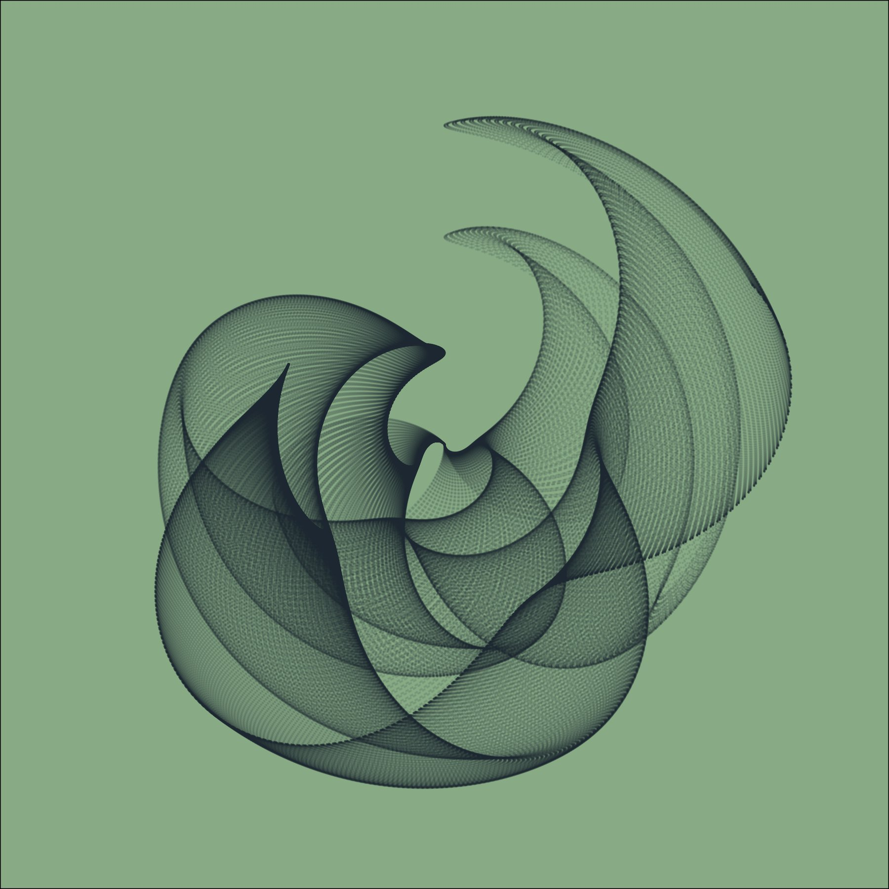
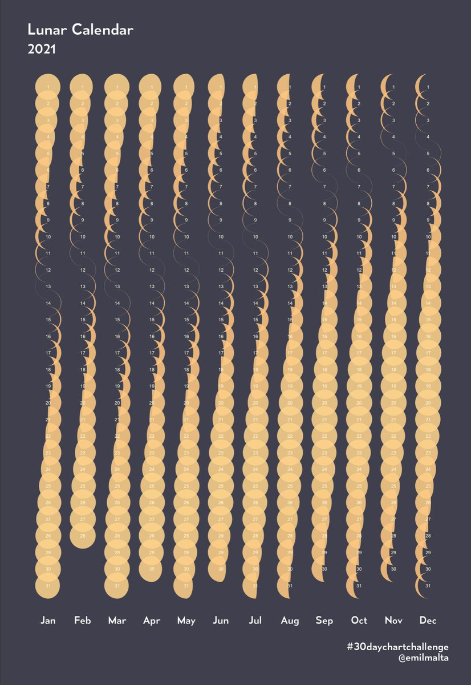

```{r setup, include=FALSE}
knitr::opts_chunk$set(echo = FALSE, message = F, warning = F)
```

```{r, message = F, echo = F}
# data packages
library(palmerpenguins)
library(babynames)
library(ggfx)
library(ggpomological)
library(circlize)
library(scales)
library(paletteer)
library(tvthemes)
```

## disclaimers

-   most of these graphs are not actually informative or helpful.
-   this class will not teach you how to make informative and helpful graphs
-   it will hopefully show you how to make fun graphs

---

## today's class :-)

-   examples of some fun and ridiculous charts!
-   some tools and packages i use
-   work time, so you can make your own fun and ridiculous graphs!
---

## starter libraries

```{r libraries, echo=TRUE, message = F}
# all hail tidyverse!
library(tidyverse)
```

---

## resources for chart types

[r graph gallery](https://www.r-graph-gallery.com/index.html)

[from data to viz](https://www.data-to-viz.com/#explore)

---

## resources for data

1.  palmerpenguins
2.  babynames
3.  [kaggle](https://www.kaggle.com/datasets)

---

## colors

```{r}
library(paletteer)
library(scales)

gt::info_paletteer(color_pkgs = NULL)
```

---

# how i make fun graphs

## Step 1

Which came first? The data or the chart?

smart thing: data, then chart  

what i do: chart, then data


--- 


## Step 2  
pick a chart type  
```{r, echo = F}

```
link [here](https://www.r-graph-gallery.com/chord-diagram.html)

---

## chord diagram!
```{r, fig.align="center", echo = F}

```

```{r, echo = T}
library(circlize)
```

---

## Step 3
Get your data!  
Game of Thrones battle data from [Kaggle](https://www.kaggle.com/mylesoneill/game-of-thrones?select=battles.csv)\
Data originally from [The War of the Five Kings dataset](https://github.com/chrisalbon/war_of_the_five_kings_dataset)

```{r, echo = F}
got <- read_csv("got_battles.csv")

attackers <- got %>%
  select(3, 6:9) %>%
  pivot_longer(cols=c(attacker_1, attacker_2, attacker_3, attacker_4), 
               names_to="val", values_to="attacker") %>%
  filter(!is.na(attacker)) %>%
  select(1, 3)

defenders <- got %>%
  select(3, 10:13) %>%
  pivot_longer(cols=c(defender_1, defender_2, defender_3, defender_4), 
               names_to="val", values_to="defender") %>%
  filter(!is.na(defender)) %>%
  select(1, 3)

battles <- attackers %>%
  full_join(defenders, by="battle_number") %>%
  select(2:3) %>%
  count(attacker, defender) %>%
  rename("from"="attacker", "to"="defender", "value"="n") %>%
  filter(!is.na(to)) 
  
merged <- battles %>%
  pivot_longer(cols=c(from, to), names_to="position", values_to="house", names_repair = "unique") %>%
  count(house) %>%
  arrange(desc(n)) %>%
  filter(n > 2)

top_houses <- merged$house

final_houses <- battles %>%
  filter(from %in% top_houses, to %in% top_houses)
```

---

## Step 4: graph!  
```{r}
chordDiagram(battles)
```
hmmm.... its messy   

---

```{r}
chordDiagram(final_houses)
```

filtered so both attacking and defending house are involved in 2 or more battles

---

## colors!
```{r, echo = T}
library(scales)
library(tvthemes)
show_col(westeros_pal(palette = "Stark")(9))
```

---

## custom color palette
```{r, echo = T}
tv_cols <- c("Baratheon" = "#FFD700","Lannister" = "#89080A",
             "Greyjoy" = "#000000","Stark" = "#174d79",
             "Mormont" = "#cadde1","Tully" = "#8b5b45", 
             "Frey" = "#4682b4","Bolton" = "#015202", 
             "Glover" = "#DCDCDC","Karstark" = "#7b906f")
show_col(tv_cols)
```

---

## all together now!
```{r, echo = F}
chordDiagram(final_houses, grid.col = tv_cols)
```

---

## game of thrones battles




---

# so what else can you do in R?

---

## basic plot (boring!)
```{r basic plot, echo = F}
ggplot(penguins, aes(x = bill_length_mm, y = body_mass_g, color = species))+
  geom_point()
```

---

## a little better (still boring!)
```{r, echo = F}
ggplot(penguins, aes(x = bill_length_mm, y = body_mass_g, color = species))+
  geom_point()+
  theme_bw()
```

---
## what about... dark theme? and neon?
```{r, echo = T}
library(ggdark)
library(ggshadow)
```

```{r, echo = F}
ggplot(penguins, aes(x = bill_length_mm, y = body_mass_g, color = species))+
  geom_glowpoint()+
  dark_theme_linedraw()
```

---

## more neon!
```{r, echo = T}
library(ggfx)
```

```{r}
ggplot(penguins, aes(x = bill_length_mm, y = body_mass_g))+
  dark_theme_linedraw()+
  with_outer_glow(geom_point(data=filter(penguins, species == 'Adelie'),fill="white"),
                  colour="dodgerblue", sigma=4, expand=2)+
  with_outer_glow(geom_point(data=filter(penguins, species == 'Gentoo'),fill="white"),
                  colour="deeppink", sigma=4, expand=2)+
  with_outer_glow(geom_point(data=filter(penguins, species == 'Chinstrap'),fill="white"),
                  colour="yellow", sigma=4, expand=2)
```

---

## themes!
```{r, echo = T}
library(ggpomological)
```
```{r}
ggplot(penguins, aes(x = bill_length_mm, y = body_mass_g, color = species))+
  geom_point()+
  scale_color_pomological()+
  theme_pomological()
```

---

## fancier!
```{r}
ggplot(penguins, aes(x = bill_length_mm, y = body_mass_g, color = species))+
  geom_point()+
  scale_color_pomological()+
 theme_pomological("Homemade Apple", 16)
```

---

## ggcute
```{r, echo = T}
library(ggcute)
```
```{r}
ggplot(penguins, aes(x = bill_length_mm, y = body_mass_g, color = species))+
  geom_point()+
  scale_color_fairyfloss()+
  theme_fairyfloss()
```

---

```{r}
ggplot(penguins, aes(x = bill_length_mm, y = body_mass_g, color = species))+
  geom_point()+
  scale_color_sugarpill()+
  theme_sugarpill()
```

---

## back to basics
```{r}
myname <- babynames::babynames %>%
  filter(name %in% c("Ingrid", "Tallulah", "Loraine"), sex == 'F') %>%
  mutate(name = factor(name, levels = c("Ingrid", "Tallulah", "Loraine")))

name_pal <- c('#58508d', '#bc5090', '#ffa600')
a <- ggplot(myname, aes(x = year, y = n, color = name))+
  geom_line()+
  theme_bw()+
  scale_color_manual(values = name_pal)

a
```

---

## neon lines!
```{r}
ggplot(myname, aes(x = year, y = n, color = name))+
  geom_line()+
  dark_theme_bw()+
  geom_glowline()+
  scale_color_manual(values = name_pal)
```

---

## we can make it ... blurry?
```{r, echo = T}
library(ggfx)
```

```{r}
with_motion_blur(a, sigma = 3)
```

---

## not sure why you'd ever need this...
```{r}
ggplot() + 
  as_reference(
    geom_polygon(aes(c(0, 0, 0), c(0, 0, 0)), colour = NA, fill = 'magenta'), 
    id = "displace_map"
  ) +
  with_displacement(
    geom_text(aes(0.45, 0.5, label = 'word art?'), size = 35, fontface = 'bold'), 
    x_map = ch_red("displace_map"), 
    y_map = ch_blue("displace_map"),
    x_scale = unit(0.025, 'npc'),
    id = "text"
  ) +
  with_blend(
    geom_density_2d_filled(aes(rnorm(1e4, 0.5, 0.2), rnorm(1e4, 0.5, 0.2)), 
                           show.legend = FALSE),
    bg_layer = "text",
    blend_type = "in",
    id = "blended"
  ) +
  scale_fill_viridis_d(option = "plasma")+
  with_shadow("blended", sigma = 3) + 
  coord_cartesian(xlim = c(0, 1), ylim = c(0, 1), clip = 'off') + 
  labs(x = NULL, y = NULL)
```

---

## moons?
```{r, echo = T}
library(gggibbous)
```

```{r}
moonphase <- subset(lunardist, !is.na(phase))
moonphase$percent <- ifelse(
  moonphase$phase == "new", 0, ifelse(moonphase$phase == "full", 1, 0.5))

ggplot(lunardist, aes(date, distance)) +
  geom_line(color = "black") +
  # Plotting the lower layer as a full circle also works in most cases
  geom_moon(data = moonphase, ratio = 1, size = 5, fill = "black") +
  geom_moon(
    data = moonphase, aes(ratio = percent),
    size = 5, fill = "yellow", right = moonphase$phase == "first quarter"
  )+
  theme_minimal()
```

---

## cats!
```{r}
library(ggcats)

ggplot(mtcars) +
  geom_cat(aes(mpg, wt), cat = "toast", size = 3)
```

---

## dogs
```{r}
library(ggdogs)
ggplot(mtcars) +
  geom_dog(aes(mpg, wt), dog = "glasses", size = 5)
```

---

## ...bernie?
```{r}
library(ggbernie)

ggplot(mtcars) +
  geom_bernie(aes(mpg, wt), bernie = "sitting")
```

---

## not my code!
```{r}
library(Ecdat)
data(incomeInequality)

library(tidyverse)
library(ggcats)
library(gganimate)


dat <-
   incomeInequality %>%
   select(Year, P99, median) %>%
   rename(income_median = median,
          income_99percent = P99) %>%
   pivot_longer(cols = starts_with("income"),
                names_to = "income",
                names_prefix = "income_")

dat$cat <- rep(NA, 132)

dat$cat[which(dat$income == "median")] <- "nyancat"
dat$cat[which(dat$income == "99percent")] <- rep(c("pop_close", "pop"), 33)

ggplot(dat, aes(x = Year, y = value, group = income, color = income)) +
   geom_line(size = 2) +
   geom_cat(aes(cat = cat), size = 5) +
   xlab("Cats") +
   ylab("Cats") +
   theme(legend.position = "none",
         plot.title = element_text(size = 20),
         axis.text = element_blank(),
         axis.ticks = element_blank()) +
   transition_reveal(Year)
```

---

## generative art



---



---



---



---



---

## more inspiration!
 
[link](https://twitter.com/emilmalta/status/1378397237957570562) here

---

[link](https://twitter.com/spcanelon/status/1483254125915746305) here


---

[link](https://twitter.com/ijeamaka_a/status/1482744453714432002) here


---

[link](https://twitter.com/ryanahart/status/1482074159815577604) here


---

## last disclaimer!

when working with random or fun packages::  
- you are probably going to experience a lot of errors. 
- sometimes installing packages is very weird and doesn't work
- sometimes knitting will decide not to work.

this is to be expected! 
- sometimes packages interact with each other weirdly. 
- sometimes they are out of date, or one of their dependencies needs to be updated

# but -- have fun with it!!

---

## code and resources

for these slides: <https://github.com/zolli22/R_graphing_paideia_2022>

for some of my example graphs: <https://twitter.com/ingrid_zoll/status/1384226763270623235>
